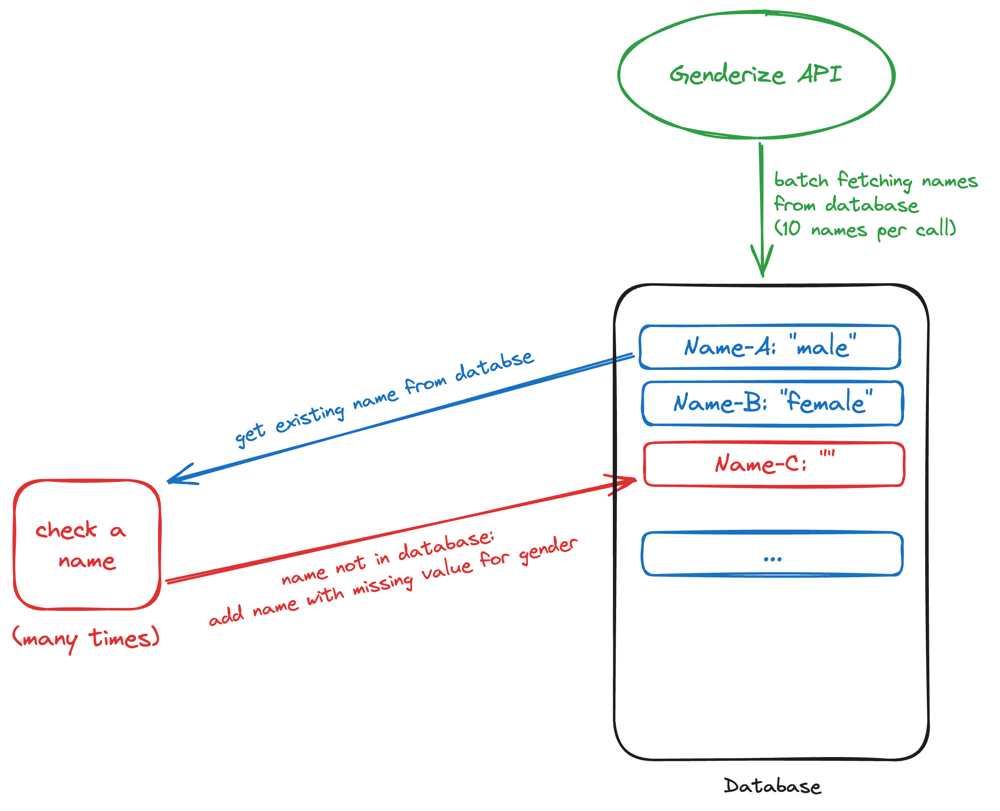

# Name Gender analyzer
Analysis of names by gender.

## Table of Content

<!-- toc -->

- [Procedure](#procedure)
	* [Technical Implementation](#technical-implementation)
- [To-do](#to-do)
	* [Short list](#short-list)
	* [Roadmap (long term)](#roadmap-long-term)
- [Data](#data)
	* [Articles](#articles)
	* [Issues](#issues)
	* [Annual Registers](#annual-registers)
	* [Sitemaps](#sitemaps)

<!-- tocstop -->

## Procedure
1. Scrap names from `APuZ`.
2. Get list of names.
3. Parse names into required format.
4. Assign gender to every name. <https://genderize.io/>
5. Calculate percentage of genders.
6. Display results.

### Technical Implementation
- Background-Service: [Genderize](https://genderize.io/) to identify gender of names
- [API rate limit without subscription: 100 calls per day, 10 names per call](https://genderize.io/faq#api-usage)



## To-do

### Short list
- [ ] Reduce number of API calls by caching first name data
- [ ] Analyze all Annual Registers (instead of small sample)
- [ ] Analyze data by year
- [ ] Plot data in a time series graph
- [ ] Detect and factor in co-authorship
- [ ] Investigate correlation between topics and gender of the author

### Roadmap (long term)
- [ ] Scrape all data before 2011
- [ ] Publish new data periodically via Mastodon
- [ ] Describe project results in a blog post

## Data

### Articles

```txt
https://www.bpb.de/shop/zeitschriften/apuz/1953-2023/520827/stalins-tod-und-das-ende-der-allmacht/
https://www.bpb.de/shop/zeitschriften/apuz/1953-2023/520821/editorial/
```

### Issues

```txt
https://www.bpb.de/shop/zeitschriften/apuz/archiv/524414/apuz-47-1953/
https://www.bpb.de/shop/zeitschriften/apuz/archiv/524422/apuz-49-1953/
https://www.bpb.de/shop/zeitschriften/apuz/archiv/524430/apuz-50-1953/
https://www.bpb.de/shop/zeitschriften/apuz/archiv/524436/apuz-51-1953/
https://www.bpb.de/shop/zeitschriften/apuz/archiv/524443/apuz-1-1954/
https://www.bpb.de/shop/zeitschriften/apuz/archiv/524449/apuz-2-1954/
https://www.bpb.de/shop/zeitschriften/apuz/archiv/525715/aus-politik-und-zeitgeschichte-1959/

https://www.bpb.de/shop/zeitschriften/apuz/archiv/531460/apuz-2-1980/

2010
https://www.bpb.de/shop/zeitschriften/apuz/32275/armut-in-deutschland/

2012
https://www.bpb.de/shop/zeitschriften/apuz/151293/weltuntergang/

https://www.bpb.de/shop/zeitschriften/apuz/diskurskultur-2023/
```# Issues

```txt
https://www.bpb.de/shop/zeitschriften/apuz/archiv/524414/apuz-47-1953/
https://www.bpb.de/shop/zeitschriften/apuz/archiv/524422/apuz-49-1953/
https://www.bpb.de/shop/zeitschriften/apuz/archiv/524430/apuz-50-1953/
https://www.bpb.de/shop/zeitschriften/apuz/archiv/524436/apuz-51-1953/
https://www.bpb.de/shop/zeitschriften/apuz/archiv/524443/apuz-1-1954/
https://www.bpb.de/shop/zeitschriften/apuz/archiv/524449/apuz-2-1954/
https://www.bpb.de/shop/zeitschriften/apuz/archiv/525715/aus-politik-und-zeitgeschichte-1959/

https://www.bpb.de/shop/zeitschriften/apuz/archiv/531460/apuz-2-1980/

2010
https://www.bpb.de/shop/zeitschriften/apuz/32275/armut-in-deutschland/

2012
https://www.bpb.de/shop/zeitschriften/apuz/151293/weltuntergang/

https://www.bpb.de/shop/zeitschriften/apuz/diskurskultur-2023/
```

### Annual Registers
*only available for 2011-2022*

```txt
https://www.bpb.de/system/files/dokument_pdf/APuZ_2011-Jahresregister_online.pdf
https://www.bpb.de/system/files/dokument_pdf/APuZ_2012-Jahresregister_online.pdf
https://www.bpb.de/system/files/dokument_pdf/APuZ_2013-Jahresregister_online_0.pdf
https://www.bpb.de/system/files/dokument_pdf/APuZ_2014_Jahresregister_online.pdf
https://www.bpb.de/system/files/dokument_pdf/APuZ_2015_Jahresregister_online.pdf
https://www.bpb.de/system/files/dokument_pdf/APuZ_2016_Jahresregister_online.pdf
https://www.bpb.de/system/files/dokument_pdf/APuZ_2017_Jahresregister_online.pdf
https://www.bpb.de/system/files/dokument_pdf/APuZ_2018_Jahresregister_online.pdf
https://www.bpb.de/system/files/dokument_pdf/APuZ_2019_Jahresregister_online.pdf
https://www.bpb.de/system/files/dokument_pdf/APuZ_2020_Jahresregister_online.pdf
https://www.bpb.de/system/files/dokument_pdf/APuZ_2021_Jahresregister_Umbruch_v3.pdf
https://www.bpb.de/system/files/dokument_pdf/APuZ_2022-Jahresregister_online.pdf
```# Annual Registers
*only available for 2011-2022*

```txt
https://www.bpb.de/system/files/dokument_pdf/APuZ_2011-Jahresregister_online.pdf
https://www.bpb.de/system/files/dokument_pdf/APuZ_2012-Jahresregister_online.pdf
https://www.bpb.de/system/files/dokument_pdf/APuZ_2013-Jahresregister_online_0.pdf
https://www.bpb.de/system/files/dokument_pdf/APuZ_2014_Jahresregister_online.pdf
https://www.bpb.de/system/files/dokument_pdf/APuZ_2015_Jahresregister_online.pdf
https://www.bpb.de/system/files/dokument_pdf/APuZ_2016_Jahresregister_online.pdf
https://www.bpb.de/system/files/dokument_pdf/APuZ_2017_Jahresregister_online.pdf
https://www.bpb.de/system/files/dokument_pdf/APuZ_2018_Jahresregister_online.pdf
https://www.bpb.de/system/files/dokument_pdf/APuZ_2019_Jahresregister_online.pdf
https://www.bpb.de/system/files/dokument_pdf/APuZ_2020_Jahresregister_online.pdf
https://www.bpb.de/system/files/dokument_pdf/APuZ_2021_Jahresregister_Umbruch_v3.pdf
https://www.bpb.de/system/files/dokument_pdf/APuZ_2022-Jahresregister_online.pdf
```

### Sitemaps
Are apparently incomplete, therefore not using this.

```bash
curl "https://www.bpb.de/sitemap.xml?page=1" > sitemap1.xml
curl "https://www.bpb.de/sitemap.xml?page=2" > sitemap2.xml
```
